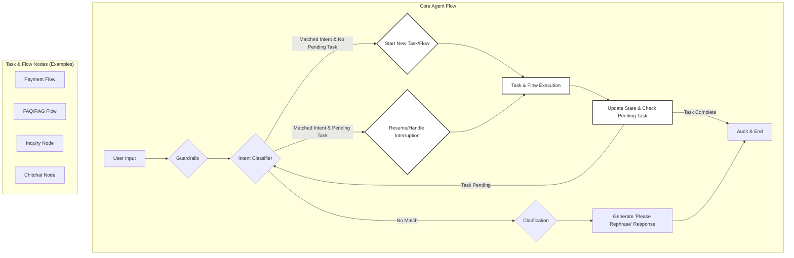

# Conversational Banking Agent with LangGraph

This project is a stateful, agentic orchestration system for conversational banking, built using **LangGraph**. It's designed to handle natural-language dialogues for banking operations (like fund transfers and inquiries) while being resilient to interruptions and context switching.

The agent is built to be highly configurable and scalable, leveraging a dynamic, hybrid task registry that derives its capabilities from both OpenAPI specifications and custom YAML configuration files.

## Key Design Principles

| Principle | Description |
| :--- | :--- |
| **Stateful per Session** | Memory is flushed after each session; only audit metadata is retained. |
| **Re-evaluate Intent Every Turn** | Supports mid-conversation topic shifts and interruptions gracefully. |
| **Task Schema Registry** | Defines and derives operational requirements from external configurations, not code. |
| **Hybrid Extensibility** | Combines backend APIs with LLM-only custom tasks (e.g., FAQs, insights). |
| **Config-Driven Architecture** | No hard-coded constants; behavior is adjustable via `.env` and YAML files. |
| **Compliance First** | Guardrails, confirmation thresholds, and audit logging are enforced at all layers. |

## Core Flow Diagram

The agent processes user input through a stateful graph. Each message is re-classified, allowing for dynamic context switching.



## Getting Started

This project uses `uv` as its package manager.

1.  **Install `uv`:**
    ```bash
    pip install uv
    ```

2.  **Create a virtual environment:**
    ```bash
    uv venv
    ```

3.  **Install dependencies:**
    ```bash
    uv pip install -r requirements.txt
    ```

4.  **Set up environment variables:**
    The project requires an OpenAI API key. Copy the `.env.example` to `.env` and add your key.
    ```bash
    cp .env.example .env
    # Now, edit .env and add your OPENAI_API_KEY
    ```

## How to Run

To start the interactive CLI for the conversational agent, run the following command from the project root:

```bash
uv run python main.py
```

## Project Structure

Here is a breakdown of the key files and directories:

```
/
├── .env                  # Environment variables (API keys, etc.)
├── main.py               # Main entry point for the CLI application
├── requirements.txt      # Project dependencies
├── config/
│   ├── config.yaml       # General application and compliance settings
│   ├── faq.md            # Knowledge base for the RAG/FAQ agent
│   ├── flow.yaml         # Defines multi-step task flows (e.g., payments)
│   ├── openapi.json      # OpenAPI spec for deriving API-backed tasks
│   └── tasks.yaml        # Custom, non-API agent tasks (e.g., inquiries, chitchat)
├── src/
│   ├── main.py           # Core LangGraph orchestration and state graph
│   ├── state.py          # Defines the shared state object for the graph
│   ├── config.py         # Loads and manages application configuration
│   ├── task_registry.py  # Loads and merges tasks from config files
│   ├── guardrails.py     # Input safety and compliance checks
│   ├── intent_classifier.py # Classifies user intent
│   ├── flow_agent.py     # Executes multi-step tasks defined in flow.yaml
│   └── knowledge_agent.py # Handles RAG-based FAQs and simple inquiries
└── tests/
    └── ...               # Unit and integration tests
```

## Configuration

The agent's behavior is almost entirely driven by external configuration files, allowing for easy extension and maintenance.

-   **`config/openapi.json`**: Defines tasks that map directly to backend API calls. The system automatically derives the required fields and endpoint information from this file.
-   **`config/tasks.yaml`**: Defines custom tasks that are handled by the agent itself, such as answering inquiries or providing insights.
-   **`config/flow.yaml`**: Orchestrates complex, multi-step tasks. For example, a `payment` flow can be defined to first collect information, then ask for confirmation, and finally execute the transfer.
-   **`config/faq.md`**: A simple Markdown file containing questions and answers that the RAG agent can use to respond to user queries.
-   **`.env`**: Holds sensitive information like API keys and environment-specific settings.

## Example Conversation

Here is an example demonstrating the agent's ability to handle interruptions:

<details>
<summary>Click to see the full conversation log</summary>

```
Starting Conversational Banking Agent...
You: i wanna transfer
Bot: Who do you want to send money to?
You: anna
Bot: How much do you want to send to anna?
You: what is my balance?
Bot: Your current balance is $1,000.00. To see your balance after a transfer, please specify the amount first.
You: okey transfer 10
Bot: Please confirm transfer to anna of $10. Approve or cancel?
You: how much my money will be after transfer?
Bot: Your current balance is $1,000.00. After transferring $10.00, your new balance will be $990.00. Do you want to confirm the transfer to anna of $10.00?
You: confirm
Bot: What is the name of the recipient's bank?
You: bca
Bot: What is the recipient's account number?
You: 12345
Bot: Transfer to anna of $10.0 at bca (account: 12345) confirmed. Your transaction succeeded.
```
</details>

### Example Flow Explained

Let's break down a key part of that conversation to see how it maps to our Core Flow Diagram.

**Turn 1: Starting the Payment Flow**
> **You**: `i wanna transfer`

1.  **[A] User Input**: The message enters the graph.
2.  **[B] Guardrails**: The message is checked for safety.
3.  **[C] Intent Classifier**: The intent is classified as `Transfer funds`.
4.  **[D] Task & Flow Nodes**: The router sees the `Transfer funds` intent and sends the conversation to the **Payment Flow**.
5.  **[E] Execute Task**: The `Payment Flow` node begins its execution. It knows from `flow.yaml` that it needs to collect the recipient's name first. It generates the question "Who do you want to send money to?" and adds it to the state.
6.  **[F] Audit & End**: The state is logged, and the bot's response is displayed to the user. A `pending_task` for the payment is now active in the agent's memory (the `State` object).

**Turn 2: The Interruption**
> **You**: `what is my balance?`

1.  **[A] User Input**: The new message enters the graph.
2.  **[B] Guardrails**: The message is checked.
3.  **[C] Intent Classifier**: The intent is classified as `INQUIRY`.
4.  **[D] Task & Flow Nodes**: The router sees the `INQUIRY` intent. It also sees that there is a `pending_task` (the payment). It recognizes this as an interruption and routes the conversation to the **Inquiry Node**.
5.  **[E] Execute Task**: The `Inquiry Node` executes. It fetches the user's balance, generates the answer, and updates the state.
6.  **[F] Audit & End**: The state is logged, and the answer about the balance is displayed. The `pending_task` for the payment is still active in the agent's memory.

**Turn 3: Resuming the Flow**
> **You**: `okey transfer 10`

1.  **[A] User Input**: The message enters the graph.
2.  **[B] Guardrails**: The message is checked.
3.  **[C] Intent Classifier**: The intent is classified as `Transfer funds` again.
4.  **[D] Task & Flow Nodes**: The router sees the `Transfer funds` intent and the active `pending_task`. It knows the user is resuming the flow and routes back to the **Payment Flow**.
5.  **[E] Execute Task**: The `Payment Flow` node resumes. It sees that the user has provided the amount (`10`) and now has all the information it needs for the next step: confirmation. It generates the confirmation message.
6.  **[F] Audit & End**: The state is logged, and the confirmation prompt is displayed, seamlessly continuing the original task.
